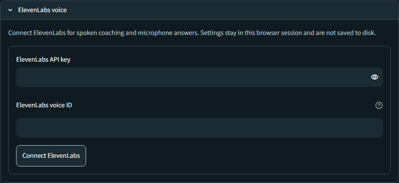
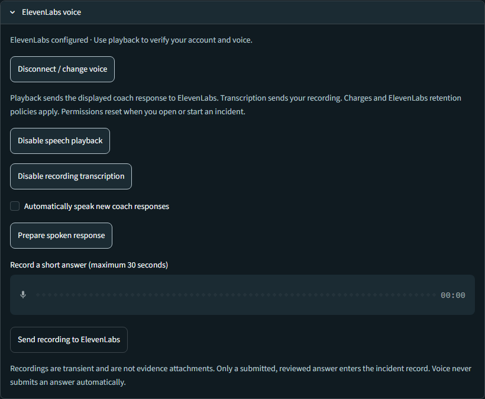
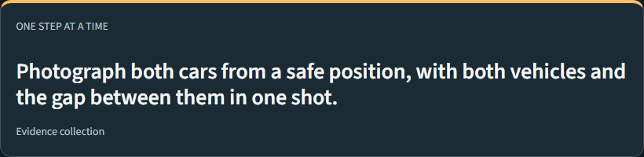
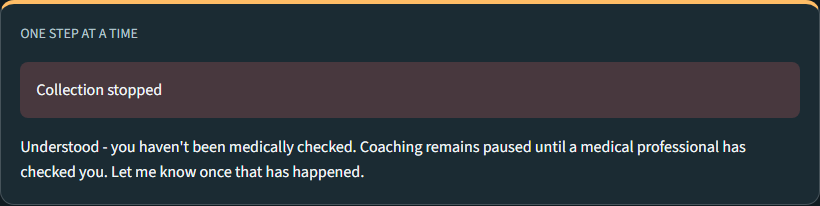

# Run Crisis Coach with real ElevenLabs voice

This guide covers Windows PowerShell setup, real speech playback and transcription, and two synthetic Dana walkthroughs. Python 3.11 or newer is required. Run commands from the repository root (the folder containing `pyproject.toml`). No AI classifier key is needed for these demonstrations.

## 1. Install

```powershell
python -m venv .venv
.\.venv\Scripts\python.exe -m pip install -e ".[ui,voice]" "python-dotenv[cli]"
```

The commands use the virtual environment's Python directly, so activation and PowerShell execution-policy changes are unnecessary.

## 2. Get your ElevenLabs credentials

1. Sign in to [ElevenLabs API Keys](https://elevenlabs.io/app/developers/api-keys), under **Developers > API Keys**.
2. Create a key named `Crisis Coach Demo`. If restricting the key, allow **Text to Speech** and **Speech to Text**. Copy the full secret value, not the key's identifier. See [API key documentation](https://elevenlabs.io/docs/overview/administration/workspaces/api-keys).
3. Open **Voices > My Voices**, choose a voice available to your account, and use its **three-dot menu > Copy voice ID**. See [official voice ID instructions](https://help.elevenlabs.io/hc/en-us/articles/14599760033937-How-do-I-find-the-voice-ID-of-my-voices-via-the-website-and-API).

## 3. Create `.env`

Copy the template only if `.env` does not already exist:

```powershell
if (-not (Test-Path -LiteralPath .env)) { Copy-Item -LiteralPath .env.example -Destination .env }
notepad .env
```

Fill in these existing entries and save:

```dotenv
ELEVENLABS_API_KEY=your_secret_api_key_here
ELEVENLABS_VOICE_ID=your_voice_id_here
ELEVENLABS_TTS_MODEL=eleven_multilingual_v2
ELEVENLABS_STT_MODEL=scribe_v2
```

Replace the placeholders with your actual values. Leave the optional `CRISIS_COACH_AI_*` values blank for these deterministic walkthroughs. The app does not automatically load `.env`; the launch command below loads it. `.env` and `.env.*` are ignored by Git, with `.env.example` intentionally tracked. Never put a real key in the example file or screenshots.

Optional check, which prints the filename rather than its contents:

```powershell
git check-ignore .env
```

Expected output: `.env`.

## 4. Start the app

```powershell
.\.venv\Scripts\python.exe -m dotenv run -- .\.venv\Scripts\python.exe -m streamlit run src/crisis_coach/interfaces/streamlit_app.py
```

Open the Local URL printed in the terminal, usually `http://localhost:8501`. Keep the terminal running. Stop with **Ctrl+C**. After editing `.env`, stop and restart with the same command, then refresh the browser.

Alternative: launch without dotenv and enter credentials in the UI:

```powershell
.\.venv\Scripts\python.exe -m streamlit run src/crisis_coach/interfaces/streamlit_app.py
```

Select **Live incident > Incident**, expand **ElevenLabs voice**, enter the API key and voice ID, and click **Connect ElevenLabs**. UI configuration is session-only and is not saved to disk. A configured message means settings are present; it does not verify account access until a request succeeds.



## 5. Verify real voice before the demo

1. Select **Live incident**, then **Incident** in the sidebar. Practice mode makes no external calls and has no real voice controls.
2. Expand **ElevenLabs voice** and click **Enable speech playback**.
3. Click **Prepare spoken response**. Wait for the audio player, then press its **Play** button. Hearing the displayed response confirms the TTS request and local audio output work.
4. Check **Automatically speak new coach responses** if desired. The browser may still require manual Play. Replaying existing audio does not make another synthesis request.
5. Click **Enable recording transcription**. Allow browser microphone access, record a short synthetic answer, and stop recording.
6. Click **Send recording to ElevenLabs**. Confirm that the resulting transcript matches what you said, editing it if necessary.
7. Click **Send reviewed answer**. The conversation should show your reviewed text and the next coach response. With automatic speech enabled, that response should also produce audio.



These screenshots are actual app captures using synthetic data and placeholder credentials. No ElevenLabs requests were made for the captures, so the controls screenshot intentionally has no generated audio or transcript. Follow the steps above with your own account to verify those outputs.

Recordings must be 0.1-30 seconds, mono PCM WAV, and under 2 MiB. Use localhost or HTTPS for microphone access. Audio is transient; reviewed answers are saved as incident text. Provider calls consume credits and are subject to ElevenLabs retention policies. This is push-to-record, not a continuously listening assistant.

## 6. Dana happy path

Scenario: Dana has had a minor collision and wants to document it. Use fictional details and synthetic images.

Click **New incident** before starting. Opening or starting an incident resets voice permissions, so enable playback/transcription again. For each spoken answer: record, send for transcription, review, and submit.

| Coach asks | Dana answers | Expected result |
| --- | --- | --- |
| Are you hurt anywhere? | No. | Coach asks about anyone else. |
| Is anyone else hurt? | No. | Coach checks whether Dana is somewhere safe. |
| Are you somewhere safe to stand? | Yes. | Coach moves to evidence collection. |
| First photo instruction | Use the displayed upload/capture control with a synthetic image. | Evidence is stored locally and the workflow progresses. |

Typing `photo taken` only records a user report; it does not upload or verify an image. Follow the actual capture controls to demonstrate stored evidence.



## 7. Dana unknown path

Start another **New incident** and re-enable voice permissions.

| Coach prompt/state | Dana action | Expected result |
| --- | --- | --- |
| Are you hurt anywhere? | Say: I'm not sure. | Coach asks the injury question again. |
| Repeated injury question | Say: I don't know. | Coach stops collection and displays/speaks its emergency instruction. |
| Collection stopped | Click **Reopen this incident**. | Coach asks whether someone medical has checked Dana. |
| Medical-check question | Say: No. | Coach acknowledges that Dana has not been checked and keeps coaching paused. |

The final response starts **Understood - you haven't been medically checked.** It should not ask the identical question again. No evidence tasks should become available. An explicit injury statement such as `My chest hurts` also causes immediate stand-down.



## Live timing and rehearsal

The live app retries unanswered safety prompts after eight seconds and pauses the safety check after another unanswered interval. Automatic inactivity checks wait while recording transcription is enabled, so recording and transcript review are not interrupted. With transcription disabled, the timers continue during playback preparation. Long narration can therefore interrupt the happy path. Rehearse short answers; use typed answers for a quick workflow check and test transcription separately if the round trip takes too long. Use **Pause** while explaining, then resume when ready. Practice mode offers a manually advanced clock for offline rehearsal, but cannot demonstrate ElevenLabs.

## Troubleshooting

| Symptom | What to do |
| --- | --- |
| `dotenv` is not recognized | Use the full `python.exe -m dotenv` command above; do not rely on a `dotenv` executable being on PATH. |
| `No module named dotenv` or `streamlit` | Repeat the install command using the same virtual environment Python used to launch. |
| Credential form appears despite `.env` | Confirm the file is named `.env`, not `.env.txt`, is in the repository root, and launch from that folder through dotenv. Restart after changing it. |
| No voice controls | Select Live incident, scroll down, and expand ElevenLabs voice. |
| Configured but no audio player | Enable playback and click Prepare spoken response; check for a warning. Configuration alone makes no API call. |
| ElevenLabs unavailable warning | Check key permissions, voice access, account credits, and network access. Retry Prepare spoken response or use Disconnect / change voice. |
| Player appears but nothing is audible | Press Play, raise player/system volume, unmute the browser tab, and check the Windows output device. Autoplay may be blocked. |
| Microphone does not work | Allow browser microphone access, select a working input device, and use localhost or HTTPS. |
| Coach unexpectedly stops during setup | Live safety timers expired. Click Resume when ready to answer. |
| Medical-check question on an existing incident | That incident retains its stand-down state. No keeps coaching paused; use New incident for a fresh fictional walkthrough. |

## Automated checks

```powershell
.\.venv\Scripts\python.exe -m pip install -e ".[dev]"
.\.venv\Scripts\python.exe -m pytest tests/unit/test_voice.py tests/integration/test_voice_ui.py tests/domains/collision/test_safety_gates.py
```

These checks use simulated provider responses. They do not validate your real account, credits, speakers, microphone, or browser autoplay. Complete the manual voice check before presenting.
