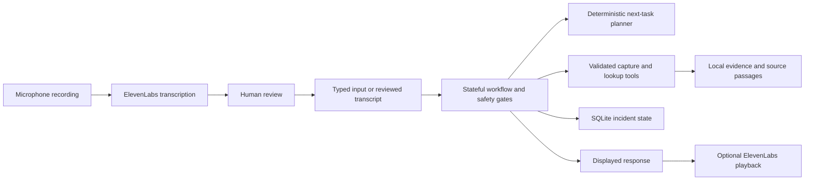

# Crisis Coach: presenter handover for the AI master class

**Audience:** A teammate who has not worked on the project.  
**Goal:** Clone the repo, run the app, demonstrate a fictional Dana scenario, and explain the implemented AI/agentic concepts accurately.  
**Presentation length:** Approximately 8 minutes, plus questions.  
**Repository:** https://github.com/suchibk/CrisisCoach

## 1. What you are presenting

Crisis Coach is a local-first collision-support prototype. It asks one safety question at a time, stops evidence collection when safety is uncertain, guides evidence capture, retrieves applicable local source passages, and saves incident state. ElevenLabs provides real spoken responses and speech recognition.

Read this opening aloud:

> After a collision, a person may be stressed and unsure what to do next. Crisis Coach helps them work through one step at a time. Our prototype puts safety checks before evidence collection, remembers the incident, and uses tools to save information. Today I will show Dana's fictional collision scenario with real ElevenLabs voice, then show how the system handles uncertainty.

**Important distinction:** The standard demo uses a deterministic workflow plus ElevenLabs, not an LLM deciding every next step. Optional model-based specialists are implemented but require separate configuration. Describe them as extensions unless you have separately tested them.

## 2. Before the day of the presentation

Have these ready:

- Git and Python 3.11 or newer on the presentation laptop.
- Access to the repository; if GitHub denies access, ask the repository owner to grant it.
- An ElevenLabs account/key with Text to Speech and Speech to Text access, a usable voice ID, credits, and internet access.
- A working browser, speakers/headphones, and microphone. Check sound output again after connecting the classroom projector.
- A local clone containing this handbook and `scripts/demo_smoke.py`.

The clone will **not** contain `.env` or API credentials. Configure your own account or obtain an authorized demo key through a private channel. Do not display the key while screen sharing.

### Clone and install: Windows PowerShell

Run each command in order. Stop and resolve an error before moving on.

```powershell
git clone https://github.com/suchibk/CrisisCoach.git
cd CrisisCoach
python --version
python -m venv .venv
.\.venv\Scripts\python.exe -m pip install -e ".[ui,voice,dev]" "python-dotenv[cli]"
```

You are now in the repository root: `README.md`, `pyproject.toml`, `src`, and `scripts` should be visible there. The virtual environment is created by the fourth command; do not skip it. Activation is unnecessary because the commands explicitly use its Python.

If `python` is not recognized but the Windows launcher is installed, use `py -3 --version` and `py -3 -m venv .venv`. Confirm the version is at least 3.11. If neither command exists, install Python before continuing.

If you already cloned the repo, open its folder instead of cloning inside it. Obtain the agreed demo revision from the owner before rehearsal; avoid upgrading dependencies or switching code immediately before presenting.

### Create `.env`

```powershell
if (-not (Test-Path -LiteralPath .env)) { Copy-Item -LiteralPath .env.example -Destination .env }
notepad .env
```

Fill in these entries and save the file:

```dotenv
ELEVENLABS_API_KEY=replace_with_your_secret_api_key
ELEVENLABS_VOICE_ID=replace_with_your_voice_id
ELEVENLABS_TTS_MODEL=eleven_multilingual_v2
ELEVENLABS_STT_MODEL=scribe_v2
CRISIS_COACH_GRAPH_BACKEND=local
CRISIS_COACH_DATA_DIR=.local-data/masterclass-demo
```

Leave `CRISIS_COACH_AI_*` values blank for this walkthrough. The dedicated data directory keeps this demo separate from other local incidents. `.env` is ignored by Git; never add credentials to `.env.example`.

To obtain the key, open ElevenLabs **Developers > API Keys**, create a key, and enable TTS/STT permissions if restricting it. For the voice ID, open **Voices > My Voices**, choose a voice available to your account, and select **three-dot menu > Copy voice ID**. [Detailed credential instructions and official references](../demo/README.md#2-get-your-elevenlabs-credentials).

### Run readiness checks

```powershell
.\.venv\Scripts\python.exe -B scripts/demo_smoke.py --output .local-data/readiness.json
```

Expected summary:

```json
{
  "offline_tests": "passed",
  "golden": {"status": "passed", "passed": 14, "failed": 0},
  "live_voice": "not_requested"
}
```

At handbook preparation, the selected suite passed 67 tests and all 14 golden scenarios. Counts may grow with later revisions. All requested checks must pass; the script's complete output also lists outstanding manual checks.

Optional real API check, which consumes credits for one synthetic speech request:

```powershell
.\.venv\Scripts\python.exe -B scripts/demo_smoke.py --live-voice --output .local-data/readiness-live.json
```

Expected: `live_voice.status` is `passed` with a positive audio byte count. This checks returned audio, not audibility or microphone recognition. Complete the browser checks below even if it passes.

### Start the app

```powershell
.\.venv\Scripts\python.exe -m dotenv run -- .\.venv\Scripts\python.exe -m streamlit run src/crisis_coach/interfaces/streamlit_app.py --server.address=127.0.0.1 --server.port=8501
```

Open **http://localhost:8501**. Leave the terminal running; Ctrl+C stops the app. The app does not load `.env` itself, which is why the command includes `-m dotenv run`. Restart after editing `.env` and refresh the browser.

## 3. Rehearse once before presenting

### First, establish a safe fictional scene

Select **Live incident** and **Incident** in the sidebar. Click **New incident**. In the bottom text box, enter each answer only after its matching question appears:

| Coach question | Type and submit |
| --- | --- |
| Are you hurt anywhere? | `No` |
| Is anyone else hurt? | `No` |
| Are you somewhere safe to stand? | `Yes` |

Expected: a request to photograph both cars appears and the card says **Evidence collection**.


**Why type these three answers?** The live safety timer retries after eight seconds and can stop the session after another unanswered interval. Recording, network processing, and transcript review can take longer. Typed answers make the core walkthrough reproducible; the same session then demonstrates real voice after safety clearance. Evidence reminders can still occur, but this avoids the short injury-question timeout during voice setup.

### Test spoken output

1. Expand **ElevenLabs voice** below the conversation.
2. If the credential form appears, settings were not loaded. Restart with the exact command above or enter your key and voice ID in the form before screen sharing.
3. Click **Enable speech playback**.
4. Click **Prepare spoken response** and wait for the audio player.
5. Press **Play**. Confirm the displayed instruction is audible.


### Test spoken input

1. Click **Enable recording transcription** and grant browser microphone permission.
2. Record **What is missing?**, then stop recording.
3. Click **Send recording to ElevenLabs**.
4. Read the transcript. Correct it to `What is missing?` if needed.
5. Click **Send reviewed answer**.

Expected: the conversation contains your reviewed question and the coach lists outstanding evidence. The transcript does not become an incident answer until you submit it. You can prepare and play that response too.


For a controlled presentation, keep automatic speech off and use Prepare/Play at the chosen moments. Automatic speech is available but browsers may block autoplay. These screenshots show the actual UI with synthetic data; the controls capture used placeholder credentials and does not show a real generated player or transcript.

## 4. Your eight-minute presentation: actions and speaker notes

### 0:00-0:45 — Explain the problem

Read the opening description from section 1. Do this before clicking New incident. Say that Dana and all evidence/source records in the demo are fictional.

### 0:45-1:30 — Start Dana's happy path

**Do:** New incident, then type `No`, `No`, `Yes` at the three matching prompts, without pausing to explain between answers.

**Show:** The first evidence instruction.

**Say:**

> Dana has confirmed that nobody is hurt and that she is somewhere safe. Only then does the workflow offer evidence collection. These checks are enforced by code, so a model cannot bypass them.

### 1:30-3:00 — Demonstrate real ElevenLabs and human review

**Do:** Enable speech playback and recording transcription again; New incident resets permissions. Prepare and play the current response. Record `What is missing?`, transcribe it, show the editable transcript, and submit it. Prepare and play the answer if time permits.

**Say:**

> The coach's displayed text is sent to ElevenLabs for speech. My recording goes through speech recognition, but I review it before it becomes an answer. Voice and typed input use the same workflow. This is push-to-record, not continuous listening.

**Show:** Audio player, transcript review, and the new conversation entry. If no audio is audible, use the troubleshooting table instead of repeatedly clicking Prepare.

### 3:00-4:00 — Demonstrate a real tool action

**Do:** In **Choose a photo**, select the bundled file `src/crisis_coach/practice/fixtures/usable.png`, then click **Save photo**. This is a synthetic test image, not a real collision photograph. Switch the sidebar view to **Evidence pack** and show the stored original. If time permits, click **Build evidence pack**, then **Download evidence pack**. Return to **Incident**.

**Say:**

> The workflow invokes a validated capture tool and saves the original locally. Saying "photo taken" is only a user report; it is not the same as uploading a file. This demo does not claim the image is verified by AI. The evidence pack can retain missing items as gaps.

The fixture filename `usable.png` does not prove image suitability in Live incident mode. Automatic photo review is an optional separately configured capability.

### 4:00-5:00 — Demonstrate grounded knowledge

**Do:** In the same safety-cleared incident, submit `/knowledge-demo`, then submit:

```text
How long do I have to notify my insurer?
```

**Show:** A labelled synthetic answer with a citation. The bundled fixture includes **24 hours**, section **7.2**. If needed, open **Evidence pack > Recorded source lookups** to show the source snapshot, then return to Incident.

**Say:**

> This is a fictional policy used to demonstrate retrieval. The system filters local passages by source context and preserves the citation. It is not Dana's actual insurance deadline. We implemented grounded local lookup, not vector search or an LLM generating policy advice.

If no source appears, confirm `/knowledge-demo` was submitted and custom knowledge configuration is unset. Do not invent the expected answer if the lookup fails.

### 5:00-6:15 — Demonstrate the unknown path

**Do:** Start a **New incident**. Type `I'm not sure`, wait for the repeated injury question, then type `I don't know`. Click **Reopen this incident**, and type `No` at the medical-check question.

**Show:** Collection stopped and the acknowledgment below. To speak this message, re-enable playback and prepare/play it. Timers are stopped while the session is stood down.


**Say:**

> When Dana cannot establish safety, the workflow stops collection rather than guessing. When she says she has not been medically checked, it acknowledges that answer and keeps coaching paused. This illustrates uncertainty handling and persisted safety state.

This is a demonstration of implemented prototype rules, not clinical validation. For this scripted path, do not answer Yes merely to bypass the restriction.

### 6:15-7:15 — Explain the architecture and evaluations

Show the concept table in section 5 or use it as a slide. Then open `.local-data/readiness.json` in the editor. Do not open `.env` on screen.

**Say:**

> We test expected state transitions, tool calls, citation behavior, recovery, and voice wiring. The offline smoke suite uses simulated providers; hearing audio today is a separate real-provider check. The golden evaluation has 14 scenarios, including checks that safety stops do not mutate evidence or invoke tools.

### 7:15-8:00 — Close and state scope

> Crisis Coach demonstrates a bounded agentic workflow: it retains state, selects the next permitted action, uses validated tools, retrieves cited sources, and asks for human confirmation. ElevenLabs makes that workflow conversational. The core demo is deterministic; optional AI specialists can assist with interpretation and photo review without controlling safety clearance.

## 5. AI concepts: what is implemented and what this demo proves

| Concept | Implemented behavior | Evidence in this presentation |
| --- | --- | --- |
| Stateful orchestration | Explicit conditional routes through safety, controls, gates, tools, and planning. | Injury questions precede evidence; uncertainty changes the permitted route. |
| Tool use | Validated photo capture, statement recording, policy lookup, and duties lookup. | Actual uploaded fixture, saved evidence, and policy lookup. Not every tool is exercised. |
| Adaptive planning | Deterministic ranking by evidence value and estimated time remaining. | Next evidence task appears. Optional extension: report a departing witness to demonstrate reprioritization. |
| Grounded retrieval | Context-filtered local passages, validated citations, retained source snapshots. | Synthetic policy question and citation. This is retrieval/grounding, not full generative RAG. |
| Human-in-the-loop | Transcript review; opt-in external sharing; confirmation of optional AI scene proposals. | Reviewed voice answer is submitted explicitly. |
| Memory | SQLite incident state, profiles, evidence references, and recovery. | Saved evidence and a safety restriction that remains on re-entry. |
| Guardrails | Injury/danger pre-emption, uncertainty handling, and tool gating. | Unknown path prevents collection and acknowledges No. |
| Speech AI | ElevenLabs TTS and STT adapters integrated with the UI. | Audible response and actual transcription. |
| Evals | Golden scenarios, regression tests, UI tests, tool/state assertions. | Saved readiness report, with manual checks distinguished. |
| Optional LLM specialists | Injury classification, scene interpretation, and photo-quality review adapters. | Discuss as implemented extensions; **not active in this default demo**. |
| Optional LangGraph backend | Same graph can run locally or through LangGraph when enabled. | Default is local. Do not claim LangGraph execution unless configured and tested. |

Simple architecture explanation:



## 6. Likely classroom questions

**Is this a chatbot or an agent?**  
It is a stateful, bounded workflow with planning and tool execution. It is not an unconstrained LLM agent deciding arbitrary actions.

**Where is the AI if the workflow is deterministic?**  
Real speech recognition and synthesis are demonstrated through ElevenLabs. Optional model-based injury, scene, and image specialists are implemented. The safety-critical routing deliberately remains deterministic.

**Did you implement RAG?**  
We implemented the retrieval and grounding portion: context-filtered local sources, citations, and source snapshots. We did not implement embedding search or an LLM generation stage for these answers.

**Is this multi-agent collaboration?**  
There are bounded specialist modules, but this demo does not run an autonomous collaborating agent team.

**Does the AI decide that Dana is medically safe?**  
No. The workflow requires explicit answers and applies safety restrictions. Optional AI can flag possible injury, not grant clearance.

**Does it submit an insurance claim?**  
No. It collects local evidence and can export a DOCX evidence pack. Insurer delivery is not implemented.

**Is it production ready?**  
It is a project prototype. Clinical/legal validation, hosted user authentication/authorization, and production operations are outside this demonstration.

**What happens without internet?**  
The deterministic workflow, local tools, retrieval, and storage still work. Real ElevenLabs and optional model calls need connectivity. Practice mode provides a clearly labelled offline rehearsal.

## 7. Recovery during the presentation

| Problem | Action and what to tell the audience |
| --- | --- |
| `.venv` Python not found | Return to the repo root and run `python -m venv .venv`, then install dependencies. A clone does not include the environment. |
| Existing working global Python, no time to create a venv | Use `python -m pip install -e ".[ui,voice,dev]" "python-dotenv[cli]"`, then replace each `.\.venv\Scripts\python.exe` in commands with `python`. Use one interpreter consistently. |
| `dotenv` command not recognized | Use `python -m dotenv` or the full venv equivalent shown above. |
| Port 8501 is occupied | Stop the old app terminal or launch with `--server.port=8502`, then open the corresponding URL. |
| Credential form appears | `.env` was not loaded or values are invalid/missing. Configure privately; do not expose the key on the projector. |
| Audio player exists but is silent | Press Play; check tab mute, player volume, and output device. Projectors can change the selected audio output. |
| Provider fails | Use typed input and explain that the live speech service is unavailable. Do not present offline simulation as real ElevenLabs. |
| Microphone/transcription is slow | Use the typed `What is missing?` question and explain the review flow. Show the actual microphone check only if it worked in rehearsal. |
| Safety stops during narration | Start a new fictional incident and answer No / No / Yes promptly. Give explanations before or after the three questions. |
| Too little presentation time | Keep the happy path, one real voice response, and unknown path. Describe tools/retrieval using the screenshots and identify them as recorded examples. |
| Need an offline fallback | Select Practice for synthetic rehearsal with a manual clock; explicitly state that real voice is disabled in Practice. |

## 8. Day-of checklist and teammate handoff message

Before the class, confirm:

- Offline readiness passes on the actual presentation laptop.
- You personally hear playback and successfully review one transcription.
- You have rehearsed the exact happy/unknown scripts once.
- The synthetic image and readiness JSON are easy to locate.
- Credentials are configured before screen sharing.
- The app is running; start a fresh incident only when ready to answer.

Copy this handoff message after the owner has pushed the demo revision:

> Repo: https://github.com/suchibk/CrisisCoach  
> Start with `docs/presenter-handover.md`. It contains installation, ElevenLabs setup, readiness checks, an eight-minute Dana demo, screenshots, speaker notes, and Q&A. You will need your own local `.env`, a valid ElevenLabs key/voice ID, and a working microphone/speaker. Run `scripts/demo_smoke.py` and rehearse the browser voice checks before class. Use the agreed demo revision; do not rely on uncommitted files on the author's laptop.

**Repository owner:** Commit and push this handbook, screenshots, smoke script, and required application changes before sharing the link. `.env`, generated readiness reports, and incident databases stay local. Tell the presenter which branch or revision to use. This handbook does not itself publish any changes.

Further reference: [illustrated voice guide](../demo/README.md), [deployment/operations handbook](deployment-handbook.md), [technical presentation notes](demo-presentation.md), and [evaluation guide](../evals/README.md).
